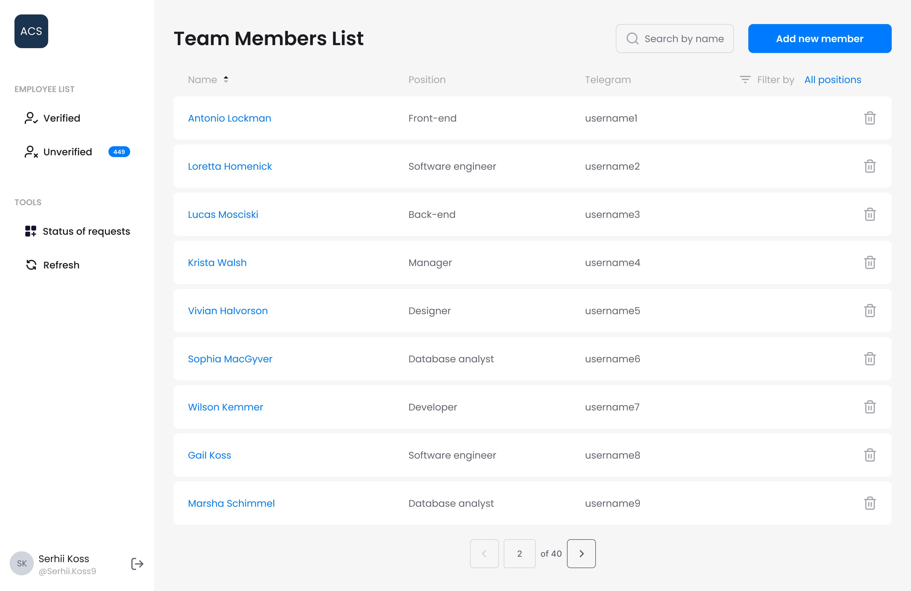

# Access Control System: README

## Project Overview
The Access Control System (ACS) is an advanced tool designed to manage and regulate access to digital resources across several modules, including GitLab, GitHub, Telegram, and Email. This project aims to provide a secure and efficient way to manage access permissions, ensuring that only authorized users can access specific resources.

## Features

**Multi-Module Monitoring:** ACS uses official service APIs to asynchronously track activity across the aforementioned modules. This ensures your confidential information is well-protected and accessible only to authorized personnel. 

**Status of Requests Window:** This feature allows you to monitor all queues in real-time, providing instant updates on every request and change happening within the system. 

**User Management:** ACS offers a detailed view of both verified and unverified users. You can manually add or delete users from these lists, providing a flexible approach to user management. Furthermore, you can view detailed profiles of verified users, including their module access levels.   

**Customizable Indexing:** The system indexes all modules at a user-defined frequency. This allows for a tailored approach to access management, ensuring that the system aligns with your specific workflow.

**Refresh Function:** This feature allows you to manually update the entire system, an individual module, or a submodule as per your needs. This ensures that your system is always up-to-date. 

## Getting Started
This section will be updated with setup instructions and basic usage guidelines. Watch this space for more detailed guides and walkthroughs to help you unlock the full capabilities of this powerful system.

## Contributing
We welcome contributions from the community. Please read our contributing guide to get started.

## License
This project is licensed under the terms of the Apache 2.0 license.

## Contact
Please feel free to reach out for any questions, suggestions, or concerns. We appreciate your feedback and look forward to improving this system to better meet your needs.
